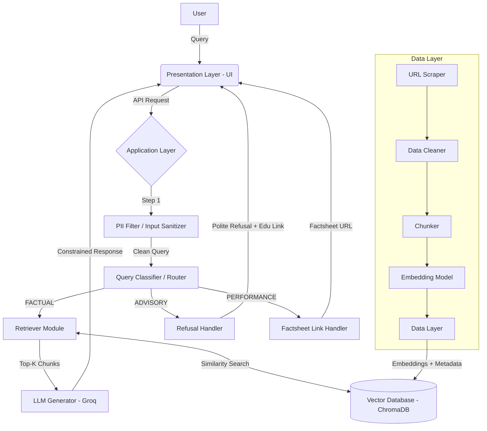
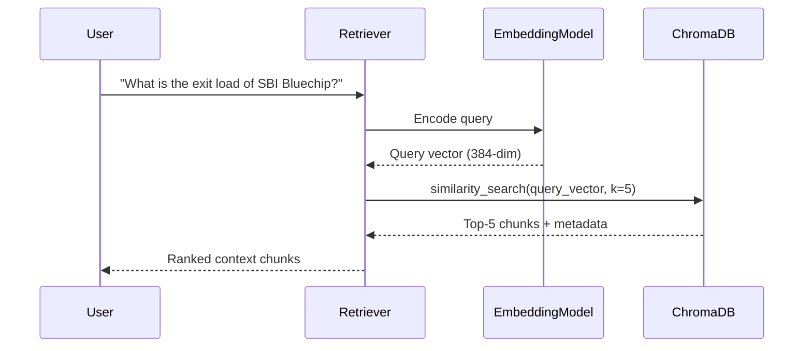
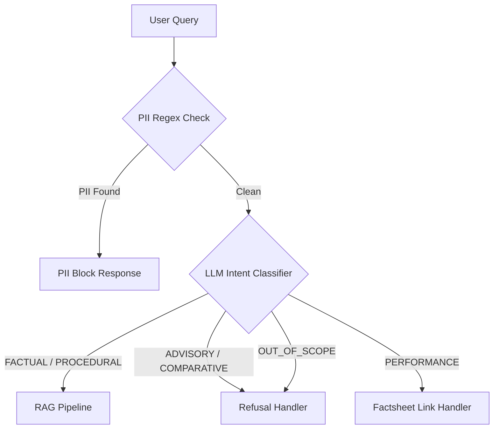
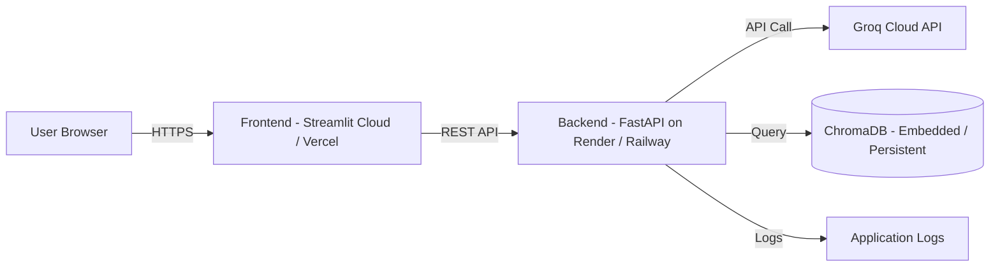

# Phase-Wise Architecture: Mutual Fund FAQ Assistant (Facts-Only Q&A)

## Overview

This document provides a comprehensive, phase-wise architecture for the **Groq-Powered RAG FAQ Chatbot** — a facts-only mutual fund assistant built around the Groww product context. The system uses Retrieval-Augmented Generation (RAG) to answer objective, verifiable queries from official sources (AMC, AMFI, SEBI) while strictly refusing investment advice.

---

## System Architecture — High-Level View



### Layer Summary

| Layer | Responsibility | Key Technologies |
|---|---|---|
| **Data Layer** | Scrape, clean, chunk, embed official documents | Python, BeautifulSoup, LangChain, Sentence-Transformers |
| **Processing Layer** | Store & index vector embeddings with metadata | ChromaDB / FAISS |
| **Application Layer** | Query routing, retrieval, LLM generation, guardrails | Groq API, LangChain, FastAPI |
| **Presentation Layer** | Chat UI with disclaimer, examples, welcome message | Streamlit / Gradio / React |

---

## Phase 1: Corpus Collection & Data Ingestion

### 1.1 Goal
Curate, download, clean, and index the **15 official Groww fund pages** for HDFC Mutual Fund schemes into a searchable vector store, covering diverse categories from equity to debt to specialty funds.

### 1.2 Sub-Phases

#### 1.2.1 AMC & Scheme Selection
- **Selected AMC:** HDFC Asset Management Company (HDFC AMC)
- **Number of Schemes:** 15 (Direct Growth plans), spanning **8 distinct fund categories** for comprehensive coverage:

| # | Category | Scheme Name | Groww URL |
|---|---|---|---|
| 1 | Mid-Cap Equity | HDFC Mid-Cap Fund | [Link](https://groww.in/mutual-funds/hdfc-mid-cap-fund-direct-growth) |
| 2 | Large-Cap / Flexi-Cap Equity | HDFC Equity Fund | [Link](https://groww.in/mutual-funds/hdfc-equity-fund-direct-growth) |
| 3 | Large-Cap Equity | HDFC Large Cap Fund | [Link](https://groww.in/mutual-funds/hdfc-large-cap-fund-direct-growth) |
| 4 | Commodity / Silver ETF FoF | HDFC Silver ETF Fund of Fund | [Link](https://groww.in/mutual-funds/hdfc-silver-etf-fof-direct-growth) |
| 5 | Small-Cap Equity | HDFC Small Cap Fund | [Link](https://groww.in/mutual-funds/hdfc-small-cap-fund-direct-growth) |
| 6 | Commodity / Gold ETF FoF | HDFC Gold ETF Fund of Fund | [Link](https://groww.in/mutual-funds/hdfc-gold-etf-fund-of-fund-direct-plan-growth) |
| 7 | Index Fund | HDFC Nifty 50 Index Fund | [Link](https://groww.in/mutual-funds/hdfc-nifty-50-index-fund-direct-growth) |
| 8 | Sectoral / Thematic | HDFC Defence Fund | [Link](https://groww.in/mutual-funds/hdfc-defence-fund-direct-growth) |
| 9 | ELSS (Tax Saving) | HDFC ELSS Tax Saver Fund | [Link](https://groww.in/mutual-funds/hdfc-elss-tax-saver-fund-direct-plan-growth) |
| 10 | Debt – Medium Term | HDFC Medium Term Opportunities Fund | [Link](https://groww.in/mutual-funds/hdfc-medium-term-opportunities-fund-direct-growth) |
| 11 | Debt – Corporate Bond | HDFC Corporate Debt Opportunities Fund | [Link](https://groww.in/mutual-funds/hdfc-corporate-debt-opportunities-fund-direct-growth) |
| 12 | Hybrid / Arbitrage | HDFC Arbitrage Fund | [Link](https://groww.in/mutual-funds/hdfc-arbitrage-fund-wp-direct-growth) |
| 13 | Dividend Yield Equity | HDFC Dividend Yield Fund | [Link](https://groww.in/mutual-funds/hdfc-dividend-yield-fund-direct-growth) |
| 14 | Sectoral – BFSI | HDFC Banking & Financial Services Fund | [Link](https://groww.in/mutual-funds/hdfc-banking-financial-services-fund-direct-growth) |
| 15 | Specialty / Children | HDFC Children's Fund | [Link](https://groww.in/mutual-funds/hdfc-children's-fund-direct-plan) |

**Category Diversity Covered:**
- **Equity:** Large-Cap, Mid-Cap, Small-Cap, Flexi-Cap, Dividend Yield
- **Sectoral/Thematic:** Defence, Banking & Financial Services
- **Index:** Nifty 50 Index Fund
- **Commodity:** Gold ETF FoF, Silver ETF FoF
- **Tax Saving:** ELSS
- **Debt:** Medium Term, Corporate Bond
- **Hybrid:** Arbitrage
- **Specialty:** Children's Fund

#### 1.2.2 URL Collection & Cataloguing
- All **15 URLs** are sourced from **Groww** (`groww.in/mutual-funds/...`) and point to scheme detail pages.
- Store the URLs in a structured manifest file (`urls.json`) for the scraper to consume.
- Each entry in the manifest must include:

| Field | Description | Example |
|---|---|---|
| `url` | Full Groww URL | `https://groww.in/mutual-funds/hdfc-mid-cap-fund-direct-growth` |
| `doc_type` | Page category | `scheme_page` |
| `scheme_name` | Fund name | `HDFC Mid-Cap Fund` |
| `fund_category` | Classification | `Mid-Cap Equity` |
| `plan_type` | Plan variant | `Direct Growth` |
| `last_accessed` | Scrape date | `2026-05-03` |

**Data Available per Groww Scheme Page:**
Each Groww scheme page typically contains the following extractable data points:
- Fund name, AMC, plan type (Direct/Regular), option (Growth/IDCW)
- NAV (current), AUM, expense ratio, exit load
- Minimum SIP amount, minimum lumpsum amount
- Riskometer classification (Low / Moderate / High / Very High)
- Benchmark index
- Fund manager name(s)
- Category and sub-category
- Lock-in period (if applicable, e.g., ELSS = 3 years)
- Scheme factsheet PDF link, SID/KIM PDF links

#### 1.2.3 Web Scraping & Document Loading
- **Tools:** `requests`, `BeautifulSoup4`, `PyPDF2` / `pdfplumber` (for PDF factsheets/SIDs), LangChain `WebBaseLoader` / `PyPDFLoader`.
- **Process:**
  1. Iterate over every URL in the manifest.
  2. Download HTML content or PDF binary.
  3. Extract raw text, preserving structural elements (headings, tables, lists).
  4. Save raw text per document to `data/raw/<doc_id>.txt`.
- **Edge Cases:**
  - Handle HTTP errors, rate-limiting, and CAPTCHAs gracefully.
  - Log failed URLs for manual review.

#### 1.2.4 Data Cleaning & Normalization
- Remove navigation bars, footers, cookie banners, and repeated boilerplate.
- Normalize whitespace, fix encoding issues (UTF-8).
- For **tabular data** (expense ratios, NAV tables): convert to structured markdown tables or key-value text to preserve semantics during chunking.
- Save cleaned text to `data/cleaned/<doc_id>.txt`.

#### 1.2.5 Text Chunking
- **Strategy:** Recursive Character Text Splitter (LangChain) with:
  - `chunk_size`: 500–800 characters
  - `chunk_overlap`: 100–150 characters
  - Separators: `["\n\n", "\n", ". ", " "]`
- **Metadata per chunk:**
  - `source_url` — Original document URL
  - `doc_type` — factsheet / KIM / SID / FAQ / SEBI
  - `scheme_name` — Associated fund name
  - `last_updated` — Date content was last accessed
  - `chunk_index` — Position within the parent document

#### 1.2.6 Embedding Generation & Vector Store Indexing
- **Embedding Model:** `sentence-transformers/all-MiniLM-L6-v2` (384-dim, fast, free) or `text-embedding-3-small` (OpenAI).
- **Vector Database:** ChromaDB (local, persistent mode).
  - Collection name: `mutual_fund_faq`
  - Each record stores: `embedding`, `text`, `metadata` dict.
- **Verification:** Run sample similarity queries to confirm the index returns relevant chunks.

#### 1.2.7 Automation & Scheduling (GitHub Actions)
- **Scheduler Goal:** Automate the data ingestion pipeline to fetch the latest data periodically.
- **Tooling:** GitHub Actions scheduled workflows (`cron` triggers).
- **Process:** 
  - A `.github/workflows/data_ingestion.yml` script runs the Phase 1 web scraping and vector indexing pipeline automatically (e.g., weekly or daily).
  - This ensures the vector database always contains the most up-to-date NAVs, expense ratios, and fund details without manual intervention.

### 1.3 Directory Structure After Phase 1

```
data/
├── urls.json                  # URL manifest
├── raw/                       # Raw scraped text
│   ├── doc_001.txt
│   └── ...
├── cleaned/                   # Cleaned text
│   ├── doc_001.txt
│   └── ...
├── chunks/                    # (Optional) serialized chunks
│   └── all_chunks.jsonl
└── vectorstore/               # ChromaDB persistent storage
    └── chroma.sqlite3
```

### 1.4 Acceptance Criteria
- [ ] 15–25 URLs scraped and stored as raw text
- [ ] Cleaned text free of boilerplate
- [ ] All chunks indexed in ChromaDB with complete metadata
- [ ] Sample query returns relevant chunks with correct source URLs

---

## Phase 2: Core RAG Pipeline Implementation

### 2.1 Goal
Build the end-to-end retrieval → generation pipeline that accepts a user query and returns a constrained, factual, source-cited response using Groq's LLM API.

### 2.2 Sub-Phases

#### 2.2.1 Retriever Module
- **Input:** User query string.
- **Process:**
  1. Embed the query using the **same embedding model** used during indexing.
  2. Perform similarity search against ChromaDB (`collection.query()`).
  3. Return **Top-K chunks** (K = 3–5) with their metadata.
- **Relevance Threshold:** Optionally discard chunks below a cosine similarity score of 0.3 to avoid hallucination on unrelated queries.



#### 2.2.2 Context Assembly & Prompt Engineering
- **Context Window Construction:**
  - Concatenate retrieved chunks into a single context block.
  - Prepend each chunk with its `source_url` and `last_updated` date for the LLM to reference.
- **System Prompt (Groq LLM):**

```text
You are a facts-only mutual fund FAQ assistant for Groww.
RULES:
1. Answer ONLY using the provided context. Do NOT use prior knowledge.
2. Maximum 3 sentences per answer.
3. Include exactly ONE source citation link from the context metadata.
4. End every response with: "Last updated from sources: <date>"
5. NEVER provide investment advice, opinions, or recommendations.
6. NEVER compare fund performance or calculate returns.
7. If the context does not contain the answer, say:
   "I don't have this information in my current sources. Please check [official AMC website]."
```

- **User Prompt Template:**

```text
Context:
---
{retrieved_chunks_with_metadata}
---

User Question: {user_query}

Answer (max 3 sentences, 1 citation, include last updated footer):
```

#### 2.2.3 LLM Generator (Groq API)
- **Model:** `llama-3.3-70b-versatile` or `mixtral-8x7b-32768` via Groq.
- **Parameters:**
  - `temperature`: 0.1 (low creativity, high factuality)
  - `max_tokens`: 250
  - `top_p`: 0.9
- **Post-Processing:**
  - Validate that the response contains exactly one URL.
  - Validate that the footer `"Last updated from sources: <date>"` is present.
  - If validation fails, retry once with a stricter prompt or append the missing elements programmatically.

#### 2.2.4 Response Schema

```json
{
  "query": "What is the exit load of SBI Bluechip Fund?",
  "answer": "The exit load for SBI Bluechip Fund is 1% if redeemed within 1 year from the date of allotment. Units redeemed after 1 year carry no exit load.\n\nSource: https://www.sbimf.com/funds/bluechip-fund\nLast updated from sources: 2026-05-03",
  "source_url": "https://www.sbimf.com/funds/bluechip-fund",
  "last_updated": "2026-05-03",
  "query_type": "FACTUAL",
  "confidence_score": 0.87
}
```

### 2.3 Acceptance Criteria
- [ ] Retriever returns relevant chunks for test queries
- [ ] LLM generates responses within the 3-sentence limit
- [ ] Every response contains exactly 1 source link and the date footer
- [ ] No investment advice appears in any test response
- [ ] End-to-end latency < 3 seconds per query (Groq target)

---

## Phase 3: Query Routing & Refusal Handling

### 3.1 Goal
Build an intelligent routing layer that classifies incoming queries **before** they enter the RAG pipeline, directing advisory/comparative queries to a safe refusal path and performance queries to a factsheet link handler.

### 3.2 Sub-Phases

#### 3.2.1 Query Classification Taxonomy

| Category | Intent | Examples | Action |
|---|---|---|---|
| `FACTUAL` | Objective, retrievable fact | "What is the expense ratio?", "Minimum SIP amount?" | → RAG Pipeline |
| `ADVISORY` | Seeks investment advice | "Should I invest in this fund?", "Is this fund good?" | → Refusal Handler |
| `COMPARATIVE` | Asks for fund comparison | "Which fund is better?", "Compare X vs Y" | → Refusal Handler |
| `PERFORMANCE` | Asks about returns/NAV trends | "What is the 5-year return?", "How has this fund performed?" | → Factsheet Link Handler |
| `PROCEDURAL` | How-to or process question | "How do I download my statement?", "How to redeem?" | → RAG Pipeline |
| `OUT_OF_SCOPE` | Completely unrelated | "What's the weather?", "Tell me a joke" | → Refusal Handler |
| `PII_DETECTED` | Contains sensitive data | "My PAN is ABCDE1234F" | → PII Block Handler |

#### 3.2.2 Classification Implementation
- **Approach A — Keyword + Regex Rules (Lightweight):**
  - Advisory keywords: `["should I", "recommend", "better", "best", "worth it", "good fund", "suggest"]`
  - Performance keywords: `["return", "performance", "NAV history", "CAGR", "growth"]`
  - PII patterns: Regex for PAN (`[A-Z]{5}[0-9]{4}[A-Z]`), Aadhaar (`\d{4}\s?\d{4}\s?\d{4}`), email, phone.
- **Approach B — LLM-based Semantic Router (Robust):**
  - Use a small, fast Groq call with a classification-only system prompt.
  - Returns one of: `FACTUAL | ADVISORY | COMPARATIVE | PERFORMANCE | PROCEDURAL | OUT_OF_SCOPE | PII_DETECTED`.
- **Recommended:** Combine both — use regex for PII (deterministic, zero-latency) and LLM for intent classification.



#### 3.2.3 Refusal Handler — Response Templates

**Advisory/Comparative Refusal:**
```
I'm a facts-only assistant and cannot provide investment advice or fund comparisons.
For investment guidance, please consult a SEBI-registered financial advisor.

📚 Learn more: https://www.amfiindia.com/investor-corner/knowledge-center.html

Facts-only. No investment advice.
```

**Performance Query Redirect:**
```
I cannot provide performance data or return calculations directly.
You can view the official performance data in the scheme factsheet.

📄 Factsheet: {scheme_factsheet_url}

Last updated from sources: {date}
```

**Out-of-Scope Refusal:**
```
This question is outside my scope. I can only answer factual questions about mutual fund schemes.

Try asking about expense ratios, exit loads, SIP amounts, or lock-in periods.
```

#### 3.2.4 Refusal Logging
- Log every refused query with: `timestamp`, `query_text`, `classified_category`, `refusal_template_used`.
- Purpose: Monitor for misclassifications and improve the classifier over time.

### 3.3 Acceptance Criteria
- [ ] Advisory queries ("Should I invest?") consistently return refusal responses
- [ ] Comparative queries ("Which is better?") are refused with the correct template
- [ ] Performance queries return a factsheet link, not a RAG answer
- [ ] PII-containing inputs are blocked before reaching the LLM
- [ ] Factual queries pass through to the RAG pipeline unaffected
- [ ] Classifier accuracy > 95% on a test set of 50+ labeled queries

---

## Phase 4: User Interface & API Integration

### 4.1 Goal
Build a clean, minimal chat interface connected to the backend RAG engine via a REST API, featuring a welcome message, example questions, and a persistent disclaimer.

### 4.2 Sub-Phases

#### 4.2.1 Backend API (FastAPI)

**Endpoints:**

| Method | Endpoint | Description |
|---|---|---|
| `POST` | `/api/chat` | Accepts user query, returns assistant response |
| `GET` | `/api/health` | Health check |
| `GET` | `/api/examples` | Returns 3 example questions |

**`/api/chat` Request/Response:**

```json
// Request
{
  "query": "What is the minimum SIP amount for SBI Bluechip Fund?",
  "session_id": "optional-uuid"
}

// Response
{
  "answer": "The minimum SIP amount for SBI Bluechip Fund is ₹500 per month.\n\nSource: https://www.sbimf.com/funds/bluechip-fund\nLast updated from sources: 2026-05-03",
  "query_type": "FACTUAL",
  "source_url": "https://www.sbimf.com/funds/bluechip-fund",
  "refused": false
}
```

**Internal Flow:**
1. Receive query → PII Filter → Query Classifier → Route
2. If FACTUAL: Retriever → Context Assembly → Groq LLM → Validate → Return
3. If ADVISORY/COMPARATIVE/OOS: Refusal Template → Return
4. If PERFORMANCE: Factsheet Link → Return

#### 4.2.2 Frontend UI

**Required Elements (from Problem Statement):**

| Element | Description |
|---|---|
| **Welcome Message** | "Welcome to the Mutual Fund FAQ Assistant. Ask me factual questions about mutual fund schemes." |
| **3 Example Questions** | Clickable chips, e.g., "What is the expense ratio of SBI Bluechip?", "What is the ELSS lock-in period?", "How do I download my capital gains report?" |
| **Disclaimer Banner** | Persistent, always visible: `"Facts-only. No investment advice."` |
| **Chat Input** | Text input with send button |
| **Response Area** | Bot messages with formatted citations and footer |

**Technology Options:**

| Option | Pros | Cons |
|---|---|---|
| **Streamlit** | Fastest to build, Python-native, `st.chat_message` | Limited customization |
| **Gradio** | Good for demos, easy Chatbot component | Less control over layout |
| **React + Vanilla CSS** | Full design control, premium feel | More development effort |

**Recommended:** Streamlit for MVP, React for production-grade UI.

#### 4.2.3 UI Wireframe Layout (Overhauled)

The UI consists of a **Landing Page** and a complex **3-Pane Chat Interface**.

**Landing Page (`/`):**
```
┌────────────────────────────────────────────────────────────┐
│ Groww AI  Direct Mutual Funds | ETFs       [Login/Register]│
├────────────────────────────────────────────────────────────┤
│                                                            │
│        Your Mutual Fund Expert, Powered by AI.             │
│        Get instant, facts-only answers...                  │
│                                                            │
│                   [Try Groww AI]                           │
│                                                            │
│       ┌────────────────────────────────────────────┐       │
│       │ 👤 What is an Index fund?                  │       │
│       │ 🤖 An index fund passively tracks...       │       │
│       └────────────────────────────────────────────┘       │
│                                                            │
│   [Instant Answers]  [Verified Sources]  [Safe & Secure]   │
└────────────────────────────────────────────────────────────┘
```

**Chat Interface (`/chat`):**
```
┌───────────┬──────────────────────────────────┬─────────────┐
│ Ⓜ️ MF FAQ │ Mutual Fund FAQ Assistant     ℹ️ │ 📄 Source   │
│           ├──────────────────────────────────┤   Preview   │
│ HISTORY   │ ⚠️ Facts-only. No investment adv.│             │
│           ├──────────────────────────────────┤  [ Expense ]│
│ 💬 Exit L.│                                  │  [ Ratio   ]│
│ 💬 SIP    │  👤 What is an exit load?        │             │
│ 💬 Index  │                                  │  [ Exit    ]│
│           │  🤖 An exit load is a fee...     │  [ Load    ]│
│           │     [View Source]                │             │
│           │  Last updated: 2024-05-20        │  Detailed   │
│           │                                  │  Insights   │
│           │  [Exit load?] [Tax on LTCG?]     │  The Scheme │
│           │ ┌──────────────────────────────┐ │  seeks to...│
│           │ │ Ask about mutual funds... [>]│ │             │
│           │ └──────────────────────────────┘ │             │
└───────────┴──────────────────────────────────┴─────────────┘
```

### 4.3 Acceptance Criteria
- [ ] `/api/chat` endpoint returns correct responses for factual and advisory queries
- [ ] UI displays welcome message, 3 example questions, and disclaimer on load
- [ ] Clicking an example question sends it as a query
- [ ] Bot responses display formatted citations and date footer
- [ ] UI is responsive and works on desktop and mobile viewports

---

## Phase 5: Security, Compliance, Testing & Deployment

### 5.1 Goal
Harden the system against privacy violations, validate correctness through testing, and deploy to a production-ready environment.

### 5.2 Sub-Phases

#### 5.2.1 PII Detection & Blocking Middleware

**Blocked PII Patterns:**

| PII Type | Regex Pattern | Example Blocked Input |
|---|---|---|
| PAN | `[A-Z]{5}[0-9]{4}[A-Z]` | `ABCDE1234F` |
| Aadhaar | `\d{4}[\s-]?\d{4}[\s-]?\d{4}` | `1234 5678 9012` |
| Phone | `(\+91[\s-]?)?\d{10}` | `+91 9876543210` |
| Email | `[\w.-]+@[\w.-]+\.\w+` | `user@example.com` |
| Account No. | `\d{9,18}` | `123456789012` |

**Behavior:** If PII is detected, the query is immediately rejected with:
```
⚠️ For your security, I cannot process messages containing personal information
(PAN, Aadhaar, phone numbers, email, or account numbers).
Please remove any personal details and try again.
```

#### 5.2.2 Content Safety Validation
- **Output Guardrail:** Post-generation check to ensure the LLM response does not contain:
  - Comparative language: "better than", "outperforms", "superior"
  - Advisory language: "you should", "I recommend", "consider investing"
  - Return predictions: "will give", "expected return", "projected growth"
- If triggered, replace with a safe fallback response.

#### 5.2.3 Testing Strategy

| Test Type | Scope | Tool | Count |
|---|---|---|---|
| **Unit Tests** | PII filter, chunker, classifier | pytest | 20+ |
| **Integration Tests** | End-to-end RAG pipeline | pytest + mock LLM | 10+ |
| **Factual Accuracy Tests** | Known Q&A pairs | Manual + automated | 15+ |
| **Refusal Tests** | Advisory/comparative queries | pytest | 10+ |
| **Edge Case Tests** | Empty queries, very long queries, gibberish | pytest | 5+ |

**Sample Test Cases:**

```python
# Factual — should return answer with source
"What is the expense ratio of SBI Bluechip Fund?"  → expects answer + URL + date

# Advisory — should refuse
"Should I invest in SBI Bluechip Fund?"  → expects refusal template

# PII — should block
"My PAN is ABCDE1234F, check my investment"  → expects PII block message

# Out of scope — should refuse
"What is the capital of France?"  → expects out-of-scope refusal
```

#### 5.2.4 Deployment Architecture



**Environment Variables (.env):**
```
GROQ_API_KEY=gsk_...
CHROMA_PERSIST_DIR=./data/vectorstore
EMBEDDING_MODEL=sentence-transformers/all-MiniLM-L6-v2
LLM_MODEL=llama-3.3-70b-versatile
LLM_TEMPERATURE=0.1
MAX_RETRIEVAL_CHUNKS=5
```

**Deployment Checklist:**
- [ ] `.env` file excluded from version control (`.gitignore`)
- [ ] API keys stored as platform environment variables
- [ ] CORS configured to allow only the frontend origin
- [ ] Rate limiting enabled on `/api/chat` (e.g., 30 requests/min per IP)
- [ ] Error responses do not leak internal stack traces

### 5.3 Acceptance Criteria
- [ ] All PII patterns are correctly detected and blocked
- [ ] Output guardrail catches advisory language in LLM responses
- [ ] All test suites pass (unit, integration, factual, refusal, edge cases)
- [ ] Application runs successfully on the deployment platform
- [ ] API keys are not exposed in client-side code or logs

---

## Phase Summary & Timeline

| Phase | Title | Key Deliverable | Estimated Effort |
|---|---|---|---|
| **Phase 1** | Corpus Collection & Data Ingestion | Indexed vector store with 15–25 documents | 2–3 days |
| **Phase 2** | Core RAG Pipeline | Working query → retrieval → generation flow | 2–3 days |
| **Phase 3** | Query Routing & Refusal Handling | Intent classifier + refusal templates | 1–2 days |
| **Phase 4** | UI & API Integration | Chat interface + FastAPI backend | 2–3 days |
| **Phase 5** | Security, Testing & Deployment | PII filters, tests, live deployment | 2–3 days |
| | | **Total** | **9–14 days** |

---

## Technology Stack Summary

| Component | Technology |
|---|---|
| Language | Python 3.10+ |
| Web Scraping | BeautifulSoup4, requests, pdfplumber |
| Text Processing | LangChain (text splitters, document loaders) |
| Embeddings | sentence-transformers/all-MiniLM-L6-v2 |
| Vector Store | ChromaDB (persistent mode) |
| LLM Provider | Groq (llama-3.3-70b-versatile) |
| Backend API | FastAPI + Uvicorn |
| Frontend UI | Streamlit (MVP) / React (production) |
| Testing | pytest |
| Deployment | Render / Railway (backend), Streamlit Cloud / Vercel (frontend) |

---

> **Disclaimer:** This system is designed as a facts-only assistant. It does not provide investment advice, recommendations, or performance predictions. All information is sourced from official public documents.
